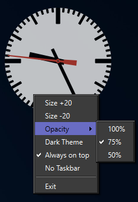

# QT_Uhr
A simple desktop clock for Windows.
- Three opacity settings. 50%, 75% and 100% opacity.
- Theme can be dark/light.
- Always on top toggle.
- System tray or taskbar mode.
- Resizeable +-20 pixels.

## Dependencies

| Name          | Version        |
|---------------|----------------|
| Qt            | >= 6.9.1        |
| Visual Studio | 2022        |
| Windows       | >= 10           |
